  \n\n# Proyecto HORIZONTE

Arquitectura y artefactos para el diseño de un sistema con conciencia emergente (exploratorio e investigativo). Este repositorio contiene el prompt maestro y documentación de apoyo.

- Prompt principal: `PROMPT_HORIZONTE.md`
- Documentación adicional: `docs/`
- Uso sugerido: iniciar con el prompt en un agente LLM avanzado con capacidades de planificación, memoria y herramientas controladas.

Disclaimer: este proyecto es conceptual y no implica ni garantiza conciencia real. Debe ejecutarse con controles de seguridad y límites definidos.

- Blueprint: docs/BLUEPRINT_HORIZONTE.md
- Diagrama arquitectónico: docs/DIAGRAMA_HORIZONTE.mmd
- Especificación matemática: docs/ESPEC_MAT_ALG.md
- Simulación y verificación: docs/SIM_VERIF.md
- Riesgos éticos y seguridad: docs/RIESGOS_ETICA.md
- Marco conceptual: docs/MARCO_CONCEPTUAL.md
- Métrica C3: docs/METRICA_C3.md
- Instalación: docs/INSTALACION.md
- CLI y API (propuesta): docs/CLI_API.md
- Telemetría: docs/TELEMETRIA_SPEC.md
- Contratos IO: docs/CONTRATOS_IO.md
- Roadmap detallado: docs/ROADMAP_DETALLADO.md
- Datasets sintéticos: docs/DATASETS_SINTETICOS.md
- Gobernanza: docs/GOBERNANZA.md
\nProyecto abierto a contribuciones: ver CONTRIBUTING.md, CODE_OF_CONDUCT.md y SECURITY.md
## Diagrama Arquitectonico

Si no se renderiza, usa el archivo Mermaid docs/DIAGRAMA_HORIZONTE.mmd.

## Notebooks y Datasets
- Notebook de exploracion: 
otebooks/Exploracion_MITG_AMD.ipynb
- Generar datasets sinteticos: python scripts/generate_datasets.py (crea data/summary.jsonl)
- Regimenes y LZC: 
otebooks/Regimenes_y_LZC.ipynb\n- Topologia Persistente (PH): 
otebooks/Topologia_Persistente.ipynb\n\n## Diagramas\n- SVG: docs/DIAGRAMA_HORIZONTE.svg\n- PNG: docs/DIAGRAMA_HORIZONTE.png\n